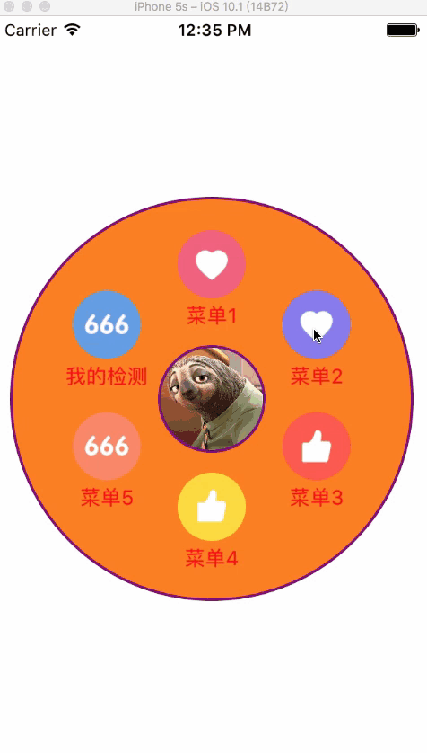
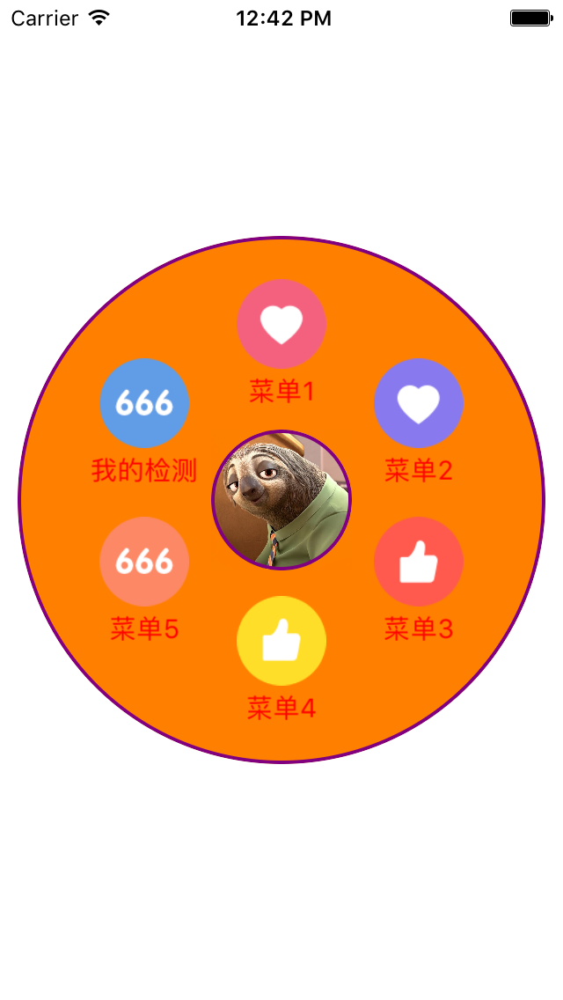

# XPCircleMenu

[]()
[]()
[]()

圆形滑动菜单，如果觉得好用，麻烦请给个`Star`。

旋转角度的计算参考了这篇文章[`Android 打造炫目的圆形菜单 秒秒钟高仿建行圆形菜单`](http://blog.csdn.net/lmj623565791/article/details/43131133)，该文章解析的很详细透彻，通俗易懂，建议阅读一下。

----




----

## 示例代码

```ObjC
XPCircleMenuView *menuView = [[XPCircleMenuView alloc] init];
menuView.frame = CGRectMake(0.0, 0.0, 300.0, 300.0);
menuView.center = self.view.center;
menuView.backgroundColor = [UIColor orangeColor];
menuView.innerCircleRadius = 40.0;
// menuView.borderLayoutMargin = 40.0;
// menuView.autoAdjustPosition = NO;
menuView.delegate = self;
menuView.menuTextColor = [UIColor redColor];
menuView.menuItems = @[
                       [XPCircleMenuItem itemWithIcon:@"gclive_favordeco_1_mt@2x.png" title:@"菜单1"],
                       [XPCircleMenuItem itemWithIcon:@"gclive_favordeco_2_mt@2x.png" title:@"菜单2"],
                       [XPCircleMenuItem itemWithIcon:@"gclive_favordeco_3_mt@2x.png" title:@"菜单3"],
                       [XPCircleMenuItem itemWithIcon:@"gclive_favordeco_4_mt@2x.png" title:@"菜单4"],
                       [XPCircleMenuItem itemWithIcon:@"gclive_favordeco_5_mt@2x.png" title:@"菜单5"],
                       [XPCircleMenuItem itemWithIcon:@"gclive_favordeco_6_mt@2x.png" title:@"我的检测"],
                       ];
menuView.identifierImageView.layer.borderColor = [[UIColor purpleColor] CGColor];
menuView.identifierImageView.layer.borderWidth = 2.0;
NSString *icon = [[NSBundle mainBundle] pathForResource:@"avatar.jpg" ofType:nil];
menuView.identifierImageView.image = [UIImage imageWithContentsOfFile:icon];
menuView.layer.borderWidth = 2.0;
menuView.layer.borderColor = [[UIColor purpleColor] CGColor];
[self.view addSubview:menuView];
```

## License

`XPCircleMenu`基于MIT License进行开源，更多内容请参看`LICENSE`文件。
